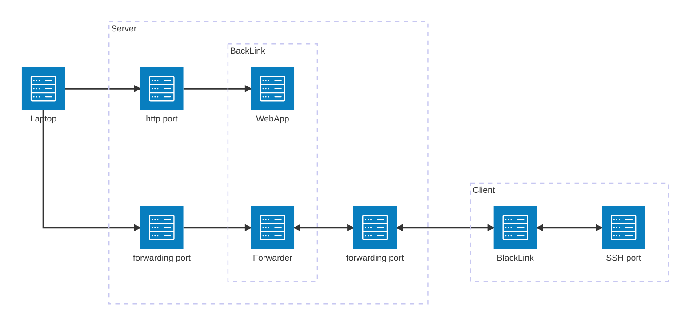
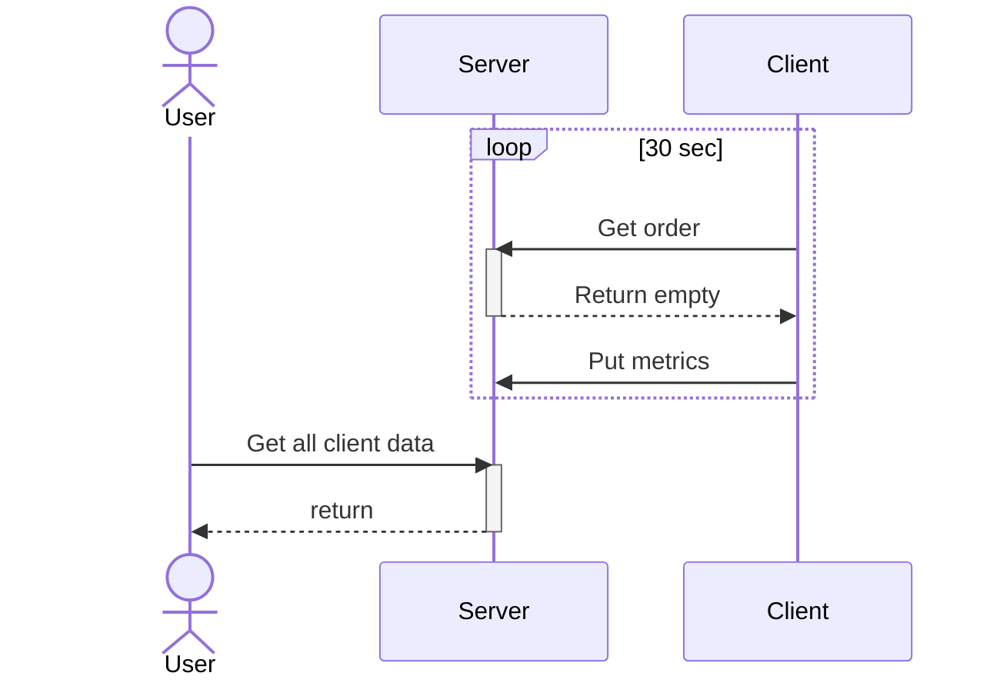
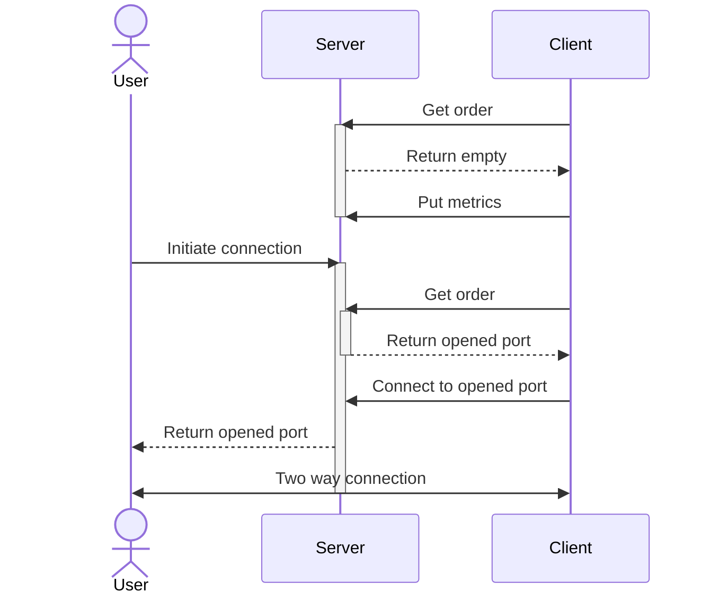

# BackChannel Server

BackChannel is a web application what provides centralized remote control for connected clients, and monitors their status in real-time.

### Screenshots


### Architecture



Sequence of monitoring:



Sequence of connecting:


## Getting started

### Generate Secret Key

Pull the latest docker image:

```bash
docker pull ghcr.io/radaron/backchannel:latest
```

Or use docker-compose:

```yaml
version: '3.8'
services:
  backchannel:
    image: ghcr.io/radaron/backchannel:latest
    ports:
      - "8000:8000"
      - 20000-20100:20000-20100
    environment:
      - SECRET_KEY=your-secret-key
      - MASTER_PASSWORD_HASH=your-master-password-hash
      - ALLOWED_ORIGINS=*
    volumes:
      - ./data:/app/data
```


For production deployment, you need to generate a secure secret key:

```bash
make generate-secret
```

This will generate a UUID-based secret key that you should set in your environment.
### Generate Password Hash

```bash
make hash-password
```
The script will prompt you to enter a password and return a base64-encoded bcrypt hash. Set this in your environment.

## Development

### Prerequisites

- Python 3.12+
- [uv](https://docs.astral.sh/uv/) package manager
- Node.js 18+ (for frontend development)
- Docker or OCI-compatible container runtime

### Development Setup

1. **Install dependencies:**
   ```bash
   make install
   ```

2. **Generate security credentials:**
   ```bash
   # Generate a secret key
   make generate-secret

   # Generate password hash
   make hash-password
   ```

3. **Set up environment:**
   ```bash
   cp backchannel.env.example backchannel.env
   # Edit backchannel.env with your generated credentials
   ```

4. **Build frontend and run the application:**
   ```bash
   make up
   ```

5. **Access the application:**
   - http://localhost:8000

## Configuration

Configuration can be customized via environment variables or the `backchannel.env` file:

- `SECRET_KEY` - Session secret key (required for production)
- `MASTER_PASSWORD_HASH` - Hashed master password (preferred over plain text)
- `SESSION_EXPIRE_MINUTES` - Session expiration time (default: 60 minutes)
- `COOKIE_NAME` - Session cookie name (default: backchannel_session)
- `ALLOWED_ORIGINS` - CORS allowed origins (default: "*")
- `PORT_RANGE_START` - Start of port range for dynamic forwarding (default: 20000)
- `PORT_RANGE_END` - End of port range for dynamic forwarding (default: 20100)
- `LOCAL_ADDRESS` - Local address to bind (default: "0.0.0.0")
- `CUSTOM_MESSAGES` - Custom connection instructions (default provided)
